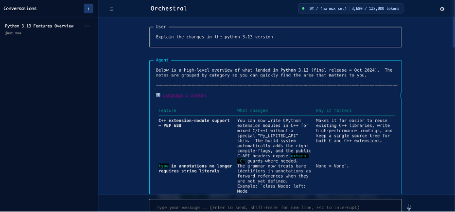
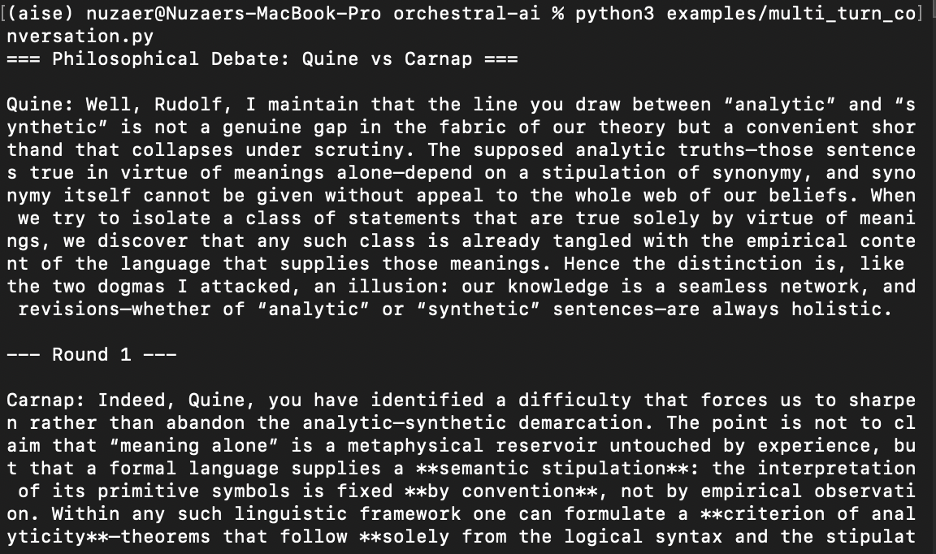

# Orchestral AI – Agent Experiments for AI-Augmented Software Engineering

<div align="center">

Agent experiments using **Orchestral AI** to explore tool-based LLM orchestration and multi-turn conversations.

</div>

---

# Project Overview

This project demonstrates how **AI agents can be orchestrated using the Orchestral AI framework**.  
The experiments explore how LLM-based agents interact through structured prompts, tools, and conversation context.

The goal is to understand how **agent orchestration frameworks manage conversations, tools, and execution flows** in AI-augmented software systems.

The repository includes examples such as:

- Multi-turn conversations between agents
- Web interface interaction with LLM agents
- Exploration of Python feature explanations using agents
- Demonstrations of how orchestration frameworks coordinate LLM responses

---

# Installation

Create a virtual environment and install dependencies.

```bash
pip install orchestral-ai
```
# API Key Setup

Create a .env file in the project directory.

Example:

OPENAI_API_KEY=your_key_here

ANTHROPIC_API_KEY=your_key_here

You only need one provider to run the examples.

# Minimal Agent Example

This example launches the Orchestral agent web interface.
Run the script:
```bash
python3 examples/minimal.py
```

Example prompt:
```bash
Explain the changes in Python 3.13
```


The agent provides structured explanations including language changes, performance improvements, and syntax updates.

# Multi-Turn Conversation Example
This experiment demonstrates structured dialogue between two agents.
```bash
python3 examples/multi_turn_conversation.py
```



Example Output:
```bash
=== Philosophical Debate: Quine vs Carnap ===

Quine:
I maintain that the distinction between analytic and synthetic
statements collapses under scrutiny...

--- Round 1 ---

Carnap:
Indeed, Quine, but the semantic stipulations of formal language
allow us to preserve analytic structure...
```
